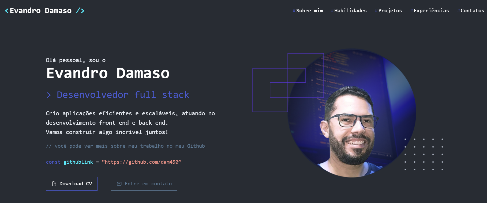

# Portfólio - Evandro Damaso



## 🎯 Sobre o Projeto

Portfólio construído para o Evandro Damaso como parte das tarefas propostas pelo Lab Yes!.

O objetivo do projeto era que cada desenvolvedor criasse um portfólio profissional para um dos seus colegas de equipe, destacando suas principais habilidades, experiências e projetos realizados. Todo o conteúdo deveria ser retirado das informações públicas do LinkedIn e GitHub. Buscando assim uma reflexão sobre que imagem temos transmitido nessas rede e o quanto a visão do outro está de fato condizente com a persona que apresentamos no dia a dia da equipe.

## 💻 Tecnologias

- React
- TypeScript
- Tailwind CSS
- Vite

## ⚡ Funcionalidades

- Seção Hero com animação de digitação
- Exibição de projetos em carrossel
- Grid responsivo de habilidades técnicas
- Links para redes sociais e contato
- Design responsivo para todas as telas

## 📝 Estrutura do Projeto

```text
src/
├── components/
│   ├── hero-section.tsx
│   ├── projects-section.tsx
│   ├── skills-section.tsx
│   ├── contacts-section.tsx
│   └── header.tsx
├── assets/
└── App.tsx
```

## 🎨 Estilos

Para esse projeto utilizei como base o design de [Elias.dev](https://www.figma.com/@elias_dev)

Além disso, para deixar o design o mais próximo da minha concepção de profissinal e personalidade do Evandro, ajustei o design trazendo mais elementos de referência ao código, trabalhando com cores, imagens e animações que completassem essa visão sobre o desenvolvedor.

O projeto utiliza variáveis CSS para cores e fontes, facilmente customizáveis em `src/index.css`.

Esse é o layout final da aplicação [Figma](https://www.figma.com/design/BVDbUMJ5zyZUpCJLU42fLM/Portf%C3%B3lio-Evandro?node-id=1-965&t=iVZk1lVyHXPZy7Cp-4)

## 🚀 Deploy

O site está disponível em: [evandrodamasodev.netlify.app/](evandrodamasodev.netlify.app/)

## 📄 Licença

Este projeto está sob a licença MIT.

## 📬 Contato

- [LinkedIn](https://www.linkedin.com/in/thalytarangel/)
- [Email](thalyta_ornelas@hotmail.com)
